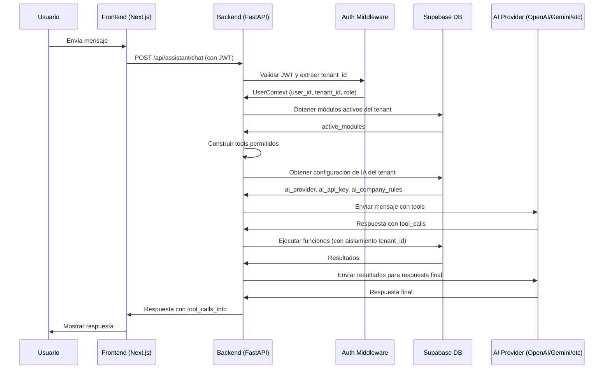

# Análisis del Proyecto: MiAsistente ERP & AI

## Resumen Ejecutivo

**MiAsistente ERP & AI** es un sistema ERP SaaS con IA integrada y arquitectura Multitenant. El sistema permite a múltiples empresas (tenants) gestionar sus operaciones de negocio con un asistente de IA inteligente que puede ejecutar operaciones transaccionales en el sistema.

## Arquitectura del Sistema

### 1. Backend (FastAPI/Python)

**Tecnologías:**
- FastAPI como framework web
- Supabase Client para base de datos
- litellm para integración con múltiples proveedores de IA
- JWT para autenticación personalizada

**Componentes Principales:**
- [`main.py`](backend/app/main.py): Entry point de la API
- [`assistant_router.py`](backend/app/assistant_router.py): Router del asistente IA con function calling
- [`routers/crm.py`](backend/app/routers/crm.py): Endpoints del módulo CRM
- [`routers/auth.py`](backend/app/routers/auth.py): Autenticación y gestión de usuarios
- [`routers/settings.py`](backend/app/routers/settings.py): Configuración del sistema
- [`db.py`](backend/app/db.py): Cliente de Supabase

**Características Clave:**
- ✅ Multitenancy con aislamiento estricto por tenant_id
- ✅ Autenticación JWT personalizada
- ✅ Integración con múltiples proveedores de IA (OpenAI, Anthropic, Gemini, Grok)
- ✅ Function calling dinámico basado en módulos activos del tenant
- ✅ Validación de tenant_id en todas las operaciones (seguridad multitenant)

### 2. Frontend (Next.js/React)

**Tecnologías:**
- Next.js 16 con App Router
- React 19
- TypeScript
- Tailwind CSS 4
- Lucide React para iconos
- Recharts para gráficos

**Componentes Principales:**
- [`layout.tsx`](frontend/src/app/(dashboard)/layout.tsx): Layout del dashboard
- [`page.tsx`](frontend/src/app/(dashboard)/page.tsx): Dashboard principal con KPIs
- [`AIAssistant.tsx`](frontend/src/components/layout/AIAssistant.tsx): Componente del asistente IA
- [`Sidebar.tsx`](frontend/src/components/layout/Sidebar.tsx): Barra lateral de navegación

**Páginas:**
- Login: [`login/page.tsx`](frontend/src/app/(auth)/login/page.tsx)
- Dashboard: [`(dashboard)/page.tsx`](frontend/src/app/(dashboard)/page.tsx)
- CRM: [`(dashboard)/crm/page.tsx`](frontend/src/app/(dashboard)/crm/page.tsx)
- Detalle Cliente: [`(dashboard)/crm/[id]/page.tsx`](frontend/src/app/(dashboard)/crm/[id]/page.tsx)
- Settings: [`(dashboard)/settings/page.tsx`](frontend/src/app/(dashboard)/settings/page.tsx)

### 3. Base de Datos (Supabase/PostgreSQL)

**Tablas Principales:**

#### Core
- [`tenants`](supabase/migrations/20260313140700_init_schema.sql:9-14): Empresas/tenants del SaaS
- [`tenant_modules`](supabase/migrations/20260313140700_init_schema.sql:18-25): Módulos activos por tenant
- [`users`](supabase/migrations/20260313140700_init_schema.sql:31-42): Usuarios del sistema con roles (super_admin, tenant_admin, regular_user)

#### CRM
- [`crm_customers`](supabase/migrations/20260313140700_init_schema.sql:49-63): Clientes y prospectos
- [`crm_quotes`](supabase/migrations/20260313140700_init_schema.sql:66-79): Cotizaciones
- [`crm_interactions`](supabase/migrations/20260315190000_add_crm_interactions.sql:2-11): Historial de interacciones con clientes

**Índices de Optimización:**
- Todos los índices están en tenant_id para optimizar consultas multitenant

## Módulos del Sistema

### 1. Core (Autenticación y Tenants)
- Gestión de tenants (empresas)
- Gestión de usuarios con roles
- Autenticación JWT personalizada
- Gestión de módulos activos por tenant

### 2. CRM (Customer Relationship Management)
- Gestión de clientes y prospectos
- Creación y gestión de cotizaciones
- Historial de interacciones (meetings, calls, emails, notes, sales)
- Búsqueda y filtrado de clientes

### 3. AI Assistant (Asistente Inteligente)
- Chat interactivo con IA
- Function calling dinámico
- Integración con múltiples proveedores de IA
- Prompt dinámico con reglas de empresa personalizadas

### 4. Settings (Configuración)
- Configuración de proveedor de IA
- Gestión de API keys
- Reglas personalizadas de empresa

## Skills del Asistente IA

### Skills Definidos (JSON Schemas)
1. [`consultar_cerebro_obsidian`](agents/skills/consultar_cerebro_obsidian.md): Búsqueda semántica en notas de Obsidian
2. [`generar_documento_pdf`](agents/skills/generar_documento_pdf.md): Generación de documentos PDF (cotizaciones, facturas proforma)
3. [`gestionar_agenda`](agents/skills/gestionar_agenda.md): Gestión de calendario (consultar disponibilidad, crear eventos)
4. [`gestionar_entidad_erp`](agents/skills/gestionar_entidad_erp.md): Operaciones CRUD en tablas del ERP

### Skills Implementados en el Backend
1. `create_crm_customer`: Crear clientes/prospectos
2. `search_crm_customers`: Buscar clientes por nombre o email
3. `update_crm_customer`: Actualizar información de clientes
4. `add_crm_interaction`: Añadir interacciones al historial
5. `get_customer_interactions`: Obtener historial completo de interacciones
6. `check_product_stock`: Consultar inventario (definido pero no implementado)
7. `search_obsidian_notes`: Buscar en base de conocimiento (definido pero no implementado)

## Flujo de Trabajo del Asistente IA

## Características de Seguridad

### Multitenancy
- ✅ Aislamiento estricto por tenant_id en todas las consultas
- ✅ Validación de tenant_id en operaciones CRUD
- ✅ Índices optimizados para consultas multitenant

### Autenticación
- ✅ JWT personalizado con roles (super_admin, tenant_admin, regular_user)
- ✅ Middleware de autenticación en todas las rutas protegidas
- ✅ Expiración de tokens

### Autorización
- ✅ Módulos activos por tenant (plug-and-play)
- ✅ Tools dinámicas basadas en módulos activos
- ✅ Validación de permisos en operaciones de base de datos

## Estado Actual del Proyecto

### Completado
- ✅ Backend FastAPI con estructura modular
- ✅ Frontend Next.js con diseño moderno
- ✅ Base de datos Supabase con esquema completo
- ✅ Sistema de autenticación JWT
- ✅ Multitenancy implementado
- ✅ Asistente IA con function calling
- ✅ Módulo CRM funcional
- ✅ Integración con múltiples proveedores de IA

### Parcialmente Implementado
- ⚠️ Skills de IA definidos pero no todos implementados:
  - `check_product_stock`: Definido pero no conectado a DB
  - `search_obsidian_notes`: Definido pero no conectado a DB
  - `generar_documento_pdf`: Definido pero no implementado
  - `gestionar_agenda`: Definido pero no implementado

### No Implementado
- ❌ Módulo de Inventario
- ❌ Módulo de Agenda/Calendario
- ❌ Módulo de Base de Conocimiento (Obsidian)
- ❌ Generación de PDFs
- ❌ Sistema de notificaciones
- ❌ Sistema de reportes y analytics
- ❌ Sistema de facturación
- ❌ Sistema de pagos (para tenants)

## Archivos de Configuración

### Backend
- [`.env`](backend/.env): Variables de entorno (Supabase URL/Key, JWT Secret)

### Frontend
- [`package.json`](frontend/package.json): Dependencias y scripts
- [`next.config.ts`](frontend/next.config.ts): Configuración de Next.js
- [`tsconfig.json`](frontend/tsconfig.json): Configuración de TypeScript
- [`tailwindcss`](frontend/postcss.config.mjs): Configuración de Tailwind CSS

## Dependencias Principales

### Backend
- fastapi
- supabase-py
- litellm
- pyjwt
- python-dotenv
- pydantic

### Frontend
- next (16.1.6)
- react (19.2.3)
- typescript
- tailwindcss (4)
- lucide-react
- recharts
- date-fns

## Observaciones y Recomendaciones

### Fortalezas
1. ✅ Arquitectura multitenant bien diseñada
2. ✅ Separación clara de responsabilidades
3. ✅ Integración flexible con múltiples proveedores de IA
4. ✅ Diseño moderno y atractivo del frontend
5. ✅ Sistema de function calling dinámico
6. ✅ Seguridad multitenant implementada correctamente

### Áreas de Mejora
1. ⚠️ Completar implementación de skills de IA
2. ⚠️ Implementar módulos faltantes (Inventario, Agenda, Base de Conocimiento)
3. ⚠️ Agregar sistema de logging y monitoreo
4. ⚠️ Implementar tests unitarios y de integración
5. ⚠️ Documentación de API (Swagger/OpenAPI)
6. ⚠️ Sistema de migraciones automatizado
7. ⚠️ Optimización de rendimiento (caching, etc.)
8. ⚠️ Sistema de backup y recuperación de datos

### Consideraciones de Seguridad
1. ⚠️ Las API keys de IA se almacenan en texto plano en la base de datos
2. ⚠️ El JWT_SECRET_KEY está en el archivo .env (debería ser un secreto en producción)
3. ⚠️ CORS configurado para permitir todos los orígenes en desarrollo

### Consideraciones de Escalabilidad
1. ⚠️ No hay implementación de caching (Redis, etc.)
2. ⚠️ No hay implementación de colas de tareas (Celery, etc.)
3. ⚠️ No hay implementación de balanceo de carga
4. ⚠️ No hay implementación de CDN para archivos estáticos

## Conclusión

El proyecto **MiAsistente ERP & AI** es un sistema ERP SaaS con una arquitectura sólida y bien diseñada. El sistema implementa correctamente el patrón multitenant y tiene una integración flexible con múltiples proveedores de IA. El frontend es moderno y atractivo, con una buena experiencia de usuario.

El proyecto está en una etapa intermedia de desarrollo, con el core y el módulo CRM funcionales, pero con varios módulos y skills de IA aún por implementar. Con el trabajo adicional en las áreas mencionadas, el proyecto tiene el potencial de convertirse en una solución ERP SaaS completa y competitiva.
